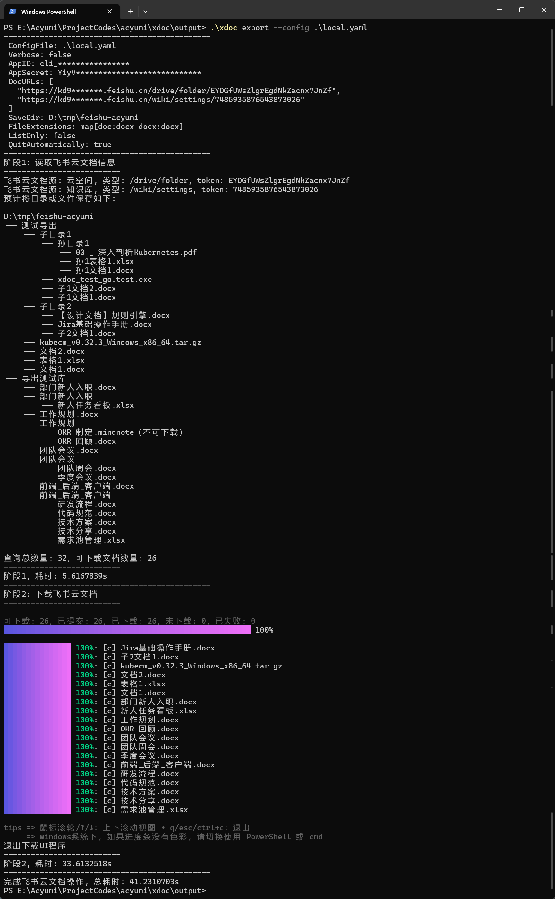

# XDoc文档导出器

> 本程序按 Apache 2.0 协议提供，作者不保证其适用性，使用风险由用户自行承担。

## 2、如何使用？

以下使用说明以windows为例，其他系统请自行变通使用

windows中建议使用 **PowerShell** (win11默认终端)执行本程序，`gitbash` 显示有点问题，效果没那么好

### 2.1、下载程序

从 [**Releases**](https://github.com/acyumi/xdoc/releases) 地址中下载相应系统的可执行程序

| OS      | 架构  | 程序               |
| ------- | ----- | ----------------- |
| windows | amd64 | xdoc.exe          |
| windows | arm64 | xdoc.arm64.exe    |
| linux   | amd64 | xdoc              |
| linux   | arm64 | xdoc.arm64.exe    |
| macos   | amd64 | xdoc.darwin       |
| macos   | arm64 | xdoc.arm64.darwin |


### 2.2、查看帮助信息

```bash
# 主命令帮助信息
.\xdoc
.\xdoc -h
.\xdoc --help

# 子命令帮忙信息
.\xdoc export -h
.\xdoc export --help
.\xdoc help export
.\xdoc export feishu -h
.\xdoc export feishu --help
.\xdoc help export feishu
```

**截图和录屏可能是旧版本的，请以实际版本的为准，关键功能不会有太大差别**


### 2.3、指定配置文件执行

```bash
# 使用当前目录的config.yaml(无参时的默认指向)
# 需要打开配置中的飞书导出开关，即export.feishu.enabled=true
.\xdoc export

# 指定当前目录下的local.yaml
.\xdoc export --config ./local.yaml

# 使用当前目录的config.yaml(无参时的默认指向)
# 如果export.feishu.enabled=false，也可以直接指向第三级命令feishu来执行
.\xdoc export feishu
```

使用yaml配置文件，参考如下

```yaml
app-id: "cli_xxx"
app-secret: "xxx"
url: "https://xxx.feishu.cn/wiki/xxx" # 注意应用需要有权限下载url对应的文档
dir: "/xxx/docs" # 注意当前用户需要在指定目录下有权限创建子目录和文件
```

更多参数及说明详见项目中的 [**config-template**](cmd/config-template.yaml)


### 2.4、指定命令行参数执行

```bash
# 指定四大必填参数，下载完成后自动退出
.\xdoc export feishu -q --app-id cli_xxxxx --app-secret xxxxxxx --dir E:\tmp\xxxx --urls https://xxx.feishu.cn/wiki/xxx
.\xdoc export feishu -quit-automatically --app-id cli_xxxxx --app-secret xxxxxxx --dir E:\tmp\xxxx --urls https://xxx.feishu.cn/wiki/xxx
.\xdoc export feishu -q --app-id=cli_xxxxx --app-secret=xxxxxxx --dir=E:\tmp\xxxx --urls=https://xxx.feishu.cn/wiki/xxx

# 只列出待下载的文档树，不进行下载
.\xdoc export feishu -l --app-id cli_xxxxx --app-secret xxxxxxx --dir E:\tmp\xxxx --urls https://xxx.feishu.cn/wiki/xxx
.\xdoc export feishu --list-only --app-id cli_xxxxx --app-secret xxxxxxx --dir E:\tmp\xxxx --urls https://xxx.feishu.cn/wiki/xxx

# 下载完成后不自动退出
.\xdoc export feishu --app-id cli_xxxxx --app-secret xxxxxxx --dir E:\tmp\xxxx --urls https://xxx.feishu.cn/wiki/xxx
.\xdoc export feishu -q=false --app-id cli_xxxxx --app-secret xxxxxxx --dir E:\tmp\xxxx --urls https://xxx.feishu.cn/wiki/xxx
```


### 2.5、导出效果演示

**注意：**

如图中所示，因为程序按用户的传参执行导出下载，可能会创建多层目录和同时下载多个文件

**如果杀毒软误报，请允许操作即可**


执行过程长截图：



报错处理：


## 3、功能说明

- 支持生成程序需要的配置文件，便捷使用
- 支持通过浏览器直接复制url下载文档及其子文档
  - 通过url自动判断是云文档还是知识库的文档
- 支持指定导出文件的类型
- 支持指定本地目录用于保存导出文件，自动创建目录
  - 云文档有目录，知识库没有（它的目录也是一个文档）
  - 导出云文档时，自动创建实际读取到的目录
    - 将不合法的目录字符串替换为下划线，如`/`替换为`_`
  - 导出知识库时，按文档层级自动创建目录，目录名为非叶子节点文档的标题
    - 自动创建的目录与源文档保存在同一级
    - 将不合法的目录字符串替换为下划线，如`/`替换为`_`
- 读取知识库文档树时，如果超时(目前为60秒)，则执行失败
  - 有些企业的知识库下的文档数量庞大，递归整棵树的用时会非常久
  - 请自行缩小范围，比如取知识库中某个节点的URL重新执行
- 碰到不支持导出的文档，会在打印的文档树中展示出来
- 导出过程会产生一个名为`document-tree.json`的文件，这是程序保留文件，以后的功能应该会用到，请不要使用它，可以删除


## 4、如何创建飞书应用和授权？

### 4.1、创建飞书应用

进入 **飞书开发者后台** https://open.feishu.cn/app , 按如下步骤进行操作


### 4.2、应用授权访问API

飞书的权限有**应用对API的访问权限**，还有**应用对文档的访问权限**

如图所示，两种权限中的任何一种未得到授权，则无法下载对应的文档


这里先讲**授权API**

程序使用的API涉及以下几个权限，请在**权限管理**中申请，待发布生效

现在飞书应用权限分为应用身份权限和用户身份权限，一般使用**应用身份权限**即可

| 权限名称                         | 权限代码                      | 对应API                                                      |
| -------------------------------- | ----------------------------- | ------------------------------------------------------------ |
| 查看云空间中文件元数据           | drive:drive.metadata:readonly | 获取文件元数据                                               |
| 查看、评论和下载云空间中所有文件 | drive:drive:readonly          | 获取文件夹中的文件清单、下载文件                             |
| 查看知识库                       | wiki:wiki:readonly            | 获取知识空间信息、获取知识空间节点信息、获取知识空间子节点列表 |
| 导出云文档                       | drive:export:readonly         | 创建导出任务、查询导出任务结果、下载导出文件                 |
| -                                | -                             | 其他权限todo，待我校验后回来补上                             |

可以用以下JSON批量导入权限、或者也可以自动按上面列表一个一个地搜索添加

```json
{
  "scopes": {
    "tenant": [
      "drive:drive.metadata:readonly",
      "drive:drive:readonly",
      "drive:export:readonly",
      "wiki:wiki:readonly"
    ],
    "user": []
  }
}
```


导入成功，等创建应用版本进行发布上线


### 4.3、创建版本发布上线


下面是企业管理员的操作，如果你不是管理员，嗯，那就催单吧


### 4.4、将机器人添加到群中

> 注意：机器人所在的应用必须创建过**版本**并且**申请上线**（如果需要审批还需要**审批通过**）后才可以使用


### 4.5、应用授权访问文档

飞书的权限有**应用对API的访问权限**，还有**应用对文档的访问权限**，这里是讲**授权文档**

因为应用需要一个机器人做为文档访问的角色，所以前面的操作都是为了应用授权访问文档做的准备工作


## 5、如何获取下载URL

直接从浏览器的地址栏上复制即可

可以是云空间的目录、文档地址，也可以是知识库的文档地址


## 6、想自己打包构建？

自行按项目要求安装相应的**go**版本

然后将代码克隆到本地，使用项目中的**builder.sh**脚本进行构建

> 因为是**shell**脚本，**windows**下可使用**gitbash**执行

```bash
# 初始化
./builder.sh init

# 跑一下单测流程，假设有PR，要求单测覆盖率达到90%
./builder.sh test

# 构建
./builder.sh build
```

## 7、后续开发计划？

> 先做功能，再美化，UI这一块我再努力搞搞，后面一点点地修之

开发的初期，是设想着能照顾到飞书、jira等云文档的导出、下载、导入、上传的

但是光搞飞书的就挺费时费神的，而且还是基于飞书的文档非常全面好用的情况下

( 好吧，每天早上起床灰常困难，精力当然没以前旺盛了 )

其他云文档的功能随缘添加吧，大家可以关注一下，我应该不会这么快就归档这个项目